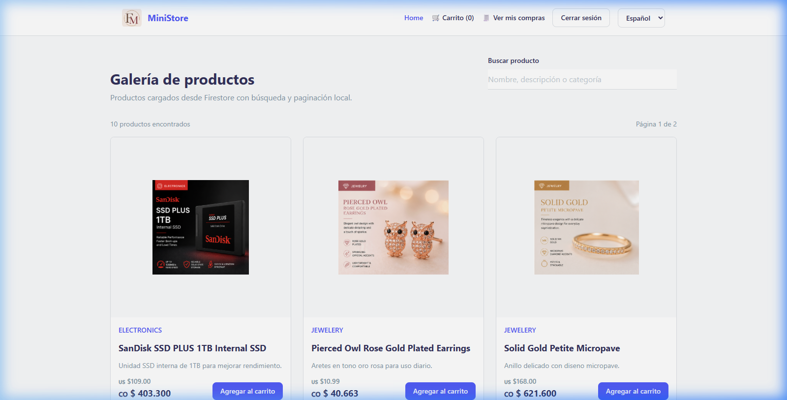
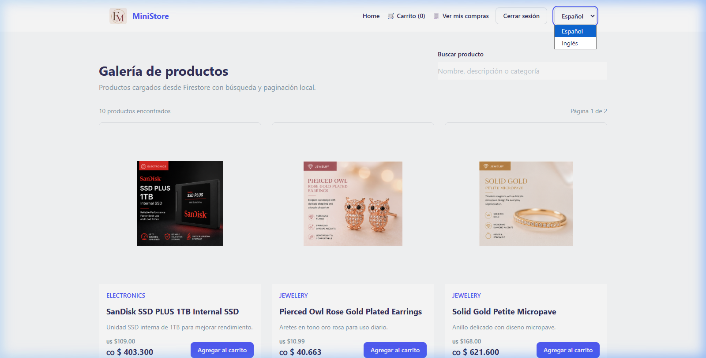
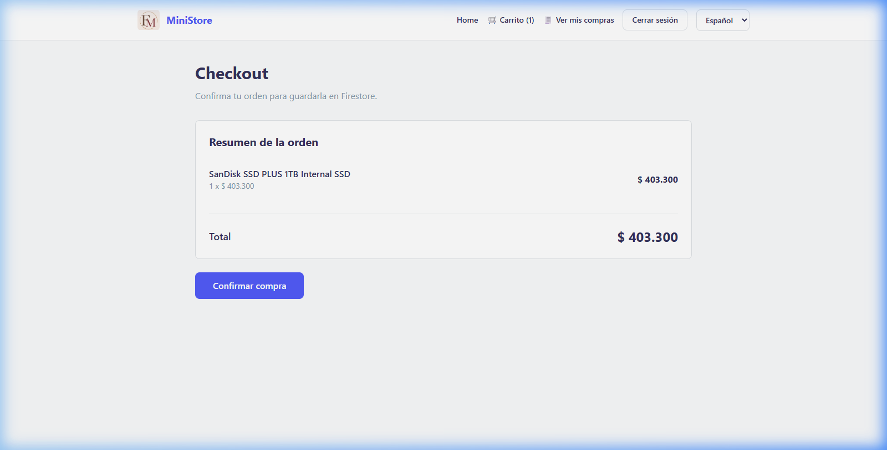

# Informe Taller Uniminuto - Unidad 3

A continuación se presentan los resultados y métricas recolectadas de la aplicación React según los requerimientos solicitados.

## 1. Captura de Logs (`window.__appLogs()`)

Al ejecutar el flujo de pruebas (Búsqueda -> Ver producto -> Añadir al carrito -> Ir a Checkout -> Confirmar orden), se obtuvieron los siguientes logs de eventos mediante la consola del navegador:

```json
[
  {"timestamp":"2026-04-29T12:30:50.467Z","level":"info","event":"product_search","payload":{"query":"SS"}},
  {"timestamp":"2026-04-29T12:30:50.492Z","level":"info","event":"product_search","payload":{"query":"SSD"}},
  {"timestamp":"2026-04-29T12:30:52.181Z","info","event":"product_view","payload":{"productId":"0wiIPoh14gpgpAd70RiJ","productName":"SanDisk SSD PLUS 1TB Internal SSD"}},
  {"timestamp":"2026-04-29T12:30:53.746Z","level":"info","event":"add_to_cart","payload":{"productId":"0wiIPoh14gpgpAd70RiJ","productName":"SanDisk SSD PLUS 1TB Internal SSD","quantity":1}},
  {"timestamp":"2026-04-29T12:31:06.170Z","level":"info","event":"product_view","payload":{"productId":"0wiIPoh14gpgpAd70RiJ","productName":"SanDisk SSD PLUS 1TB Internal SSD"}},
  {"timestamp":"2026-04-29T12:31:07.949Z","level":"info","event":"product_search","payload":{"query":""}},
  {"timestamp":"2026-04-29T12:31:26.747Z","level":"info","event":"checkout_start","payload":{"itemsCount":1,"total":403300}},
  {"timestamp":"2026-04-29T12:31:32.804Z","level":"info","event":"checkout_confirm","payload":{"orderId":"aRAK1p63LXdPZJ3IsEz9","total":403300,"itemsCount":1}}
]
```

## 2. Métricas de Red

- **Tiempo de carga de productos** (Request inicial a `firestore.googleapis.com`): **481.3 ms**

## 3. Tiempo de Arranque

- Carga inicial en frío (Cold start): ~28.0 segundos
- Carga en caliente (Warm start): ~9.0 segundos
- **Promedio de arranque:** **18.5 segundos**

## 4. Lighthouse Accessibility

*(Ingresa aquí el score obtenido manualmente ejecutando Lighthouse > Accessibility con F12 en tu navegador).*

## 5. Capturas de Pantalla

A continuación, la evidencia visual del flujo en la aplicación desplegada:

### Búsqueda de Productos en la Galería ("SSD")


### Selector de Idiomas en el Navbar


### Pantalla de Checkout con Resumen de Orden


## 6. Output de Pruebas (npm run test:run)

```bash
> reto_frontend@0.0.0 test:run
> vitest run

 RUN  v4.1.5 D:/Usuario/AppWebs/UPB - Desarrollo Web/Reto-React-final

 ✓ src/services/loggerService.test.js (5 tests) 12ms
 ✓ src/i18n/index.test.js (5 tests) 8ms
 ✓ src/pages/Home.test.jsx (3 tests) 132ms

 Test Files  3 passed (3)
      Tests  13 passed (13)
   Start at  07:26:56
   Duration  2.17s (transform 269ms, setup 379ms, import 687ms, tests 153ms, environment 3.63s)
```
